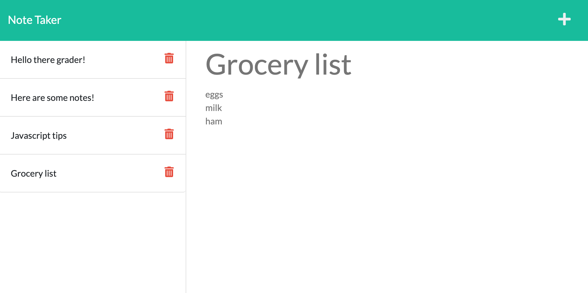

# Express-Note-Taker
A note-taking web application powered by Express.js and deployed to Heroku.

## Description
The purpose of this project was to create a functioning back-end for a note-taking web application that works with `GET`, `POST`, and `DELETE` requests using Express.js. The project also demonstrates modular routing for cleaner and easier-to-read code. All of the user-input notes are then saved into the `db.json` file.

In addition to creating a functional back-end, this project was a learning experience as I had to learn how to successfully deploy the website to Heroku and fix any Heroku-specific bugs that weren't present in the locally hosted version.

The link to the deployed website can be accessed in the [Demonstration](#demonstration) section.

## Table of Contents
* [Installation](#installation)
* [Licenses](#licenses)
* [Demonstration](#demonstration)
* [Questions](#questions)

## Installation
This project is primarily powered by Express.js which means you must have Node.js installed. It also utilizes the following npm packages which can be installed by running `npm install` in the root directory of this repo in your terminal.

The app utilizes:
* Express.js - Used for all the back-end routing and handling of `POST`, `GET`, and `DELETE` requests
* Uniqid - Used for generating a random id value to every generated note

The website can be accessed by simply clicking the live Heroku link or can be run locally on `localhost:3001` by executing `node server.js`.

## Licenses
This project falls under the following license(s): 

* Public Domain (No license)

## Demonstration
Below is a screenshot of the web application running with various saved notes on the left hand column.

The deployed version of the website can be found [here.](https://guarded-everglades-74381.herokuapp.com)

## Questions
If you have any questions or comments please contact me below: 

Github: [TonyQ032](https://github.com/TonyQ032) 

Email: AnthonyQ032@gmail.com
